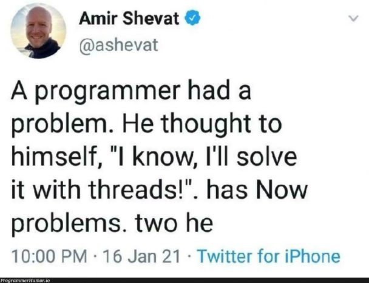

# Java Concurrency - Handbook/Guide Repository of concurrency & multithreading

Hello World!

In this repository, I am going to deep dive in the topic of
concurrency using **java**, which is **one of the most important must-knows
in Computer Science/Informatics.**

We will start from basics of **Processes,
threads, cores and schedulers** and move to practical and theoretical topics
using java: Threads, Futures, Locks, Semaphores. etc.

Each chapter here will be linked with its source code folder. **I develop
this repository as a personal deep dive and making it shareable for persons
who are looking for consolidated handbook for that topic.**

**Happy Coding!**

