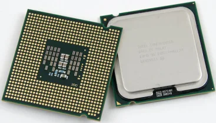
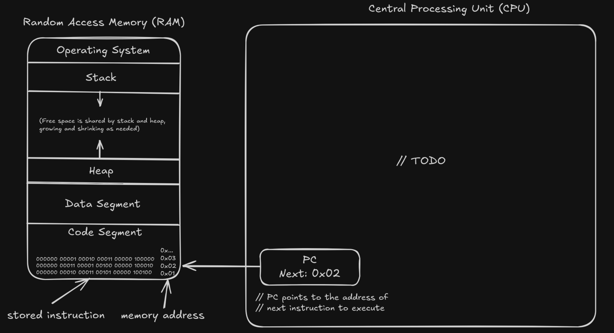

# What is the CPU?

## General Introduction

CPU - Central Processing Unit is the primary part of a computer which is 
responsible for executing instructions. It acts like a "brain of the computer"
and can execute calculations, logic operations and data management specified
instructions.

## Components of a CPU

CPU itself is composed of several components, each responsible for specific
purpose.

before, listing the specific components, lets write the basic workflow of
CPU instruction execution and explain the parts one-by-one

### 0. Prologue

Machine code (compiled instructions, ready to execute) is loaded in Random Access
Memory by Operating System in the code segment. This segment in RAM is read-only
to prevent further modification during execution. (view below schema)

In CPU the component called Program Counter (PC) stores the pointer (memory address) 
of the next instruction to execute (later it iterates the instructions as intended to point to the
next instruction from RAM code segment to execute).

### 1. Fetch:
The Control Unit (CU) retrieves the next instruction from memory (RAM) based on
the address of the next instruction to execute, managed by Program Counter (PC).
After fetch, Program Counter pointer is updated and points to the next instruction
to execute later.

### 2. Decode

The fetched instruction is decoded by Control Unit (CU) itself and determines
the required operation and operands to be used. Type of instruction and its decoding
depends on ISA (Instruction Set Architecture) which is predefined table of types and
semantics of instructions. Also it determines the operands of the operation (for example
for ADD instruction it sees the address of both operands are specified, etc)

Firstly, it checks the opcode part, which indicates the category:
- Data transfer instruction (CPU Registers, Memory, I/O Devices)
  - Move data from A to B register in CPU Memory
  - Load data from X to CPU Memory
  - Store data from CPU memory to X
  - etc...
- ALU instruction (Arithmetical or logical operation)
  - Add, Subtract, Multiply, Divide numbers...
  - Perform Logical AND/OR/XOR/NOT...
- Control Flow instruction (Jumps, Branch equality checks, etc)
  - Jump from one instruction to another (exit from while branch, etc)
  - Check if branch is equal (if, while conditions) and jump over the block otherwise
- Others... (depends on CPU and its ISA)

After decoding of operation type and its operands, now CU determines the component
to use for execution for example use ALU for arithmetical/logical operation, use
Registers to store operands of operations, use call RAM to fetch data from it, or
just get back to PC and update next instruction if Jump happened (while, if blocks...)
and others.

### Execution

After job addressing from CU (Control Unit) the CPU Registry, ALU, or other executive
components are used (one-of or multiple together) to get the result.

1. Accessing operands:
   - Get From RAM: If there is address of operand involved from RAM, fetch it from there to CPU register
   for operational access.
   - Get From Register: If the operand is located on register itself, it can be accessed directly
   - Immediate Values: If the operand is a constant, (i.e for addition or other) it is directly used for operation
2. Performing the operation: (Assembly instruction examples below are general and arbitrary!)
   - Arithmetic/Logical operations: executed in ALU using the operands accessed previously
     - Example: ADD $S5 $S6 - stores sum of numbers located at registry address $S5 and $S6 are stored at the address of first operand
   - Data Transfer operations: moves data between registers, memory and I/O devices as given
     - Example: LOAD $S3 1234 - loads data stored at RAM address 1234 into the CPU registry of $S3 
   - Control Flow Operations: jumps from Instruction A to B or executes similar tasks, like checking branch conditions
     - Example: JMP 200 - PC is set to address 200, the address of next instruction to be run (modifying pointer)
   - Others (like floating point arithmetic, system instructions and others depending on architecture)
3. Result storage: the outcome of the operation is stored in the specific location
   - Register: result of operation (arithmetic, logical...) is stored in CPU register
   - Memory: usually for store operations (Data transfer operation type), data is written to specific RAM address
   - Flags Update: there are zero flag, carry flag and others for arithmetics and others, which are updated sometimes, used for later instructions
4. Program Counter Update: After completion, PC pointer is updated to the next instruction to execute.

After completion, the same routine of fetch-decode-execute repeats, running the next instructions stored in RAM Code Segment.

### Summary: Fetch-Decode-Execute

To summarize, we fetch the data from memory, decode it, execute in specific part and store the result according to the instruction and
same cycle repeats, fetching the next memory pointed by PC. So this is the basic workflow of the Central Processing Unit,
being a computational brain of the computer.

This is the essence of computer architecture. We stop here and explore abstract topics for our scope, like
Cores, Multi-Core processing, etc.